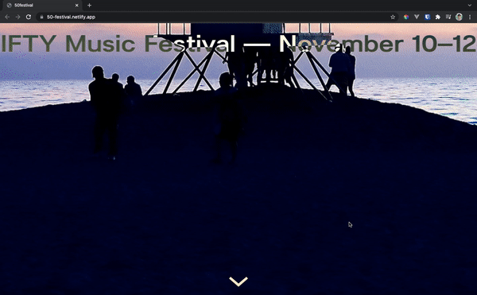

# 50festival

[50-festival.netlify.app](https://50-festival.netlify.app/) <br/>

 <br/>
I made this project as a part of SuperHi Course "Advanced CSS + Javascript" <br/>

I'd like to mention I didn't just follow it but also added some changes myself.

First of all, SuperHi has its own editor and publishes your project for you, which is nice indeed but I don't really need it, so
:white_check_mark: I made this site using Vue 3 and deployed it on Netlify

:white_check_mark: converted px to rem

:white_check_mark: added media queries for squiggles (as their size didn't change no matter what screen size it was)

:white_check_mark: added media query for first day title (on smaller screens it would blend with circle shapes as they have the same color)

:blue_book: small side note: I disabled submit button as I don't want to collect any data (this project wasn't the purpose of it), but it was interesting to get to know that you can achieve this by using [Campaign Monitor](https://www.campaignmonitor.com/)

:crystal_ball: I truly enjoyed doing [50 FESTIVAL project](https://50-festival.netlify.app/) and learnt new CSS and Javascript tricks.

## Project setup

```
npm install
```

### Compiles and hot-reloads for development

```
npm run serve
```

### Compiles and minifies for production

```
npm run build
```

### Lints and fixes files

```
npm run lint
```

### Customize configuration

See [Configuration Reference](https://cli.vuejs.org/config/).
